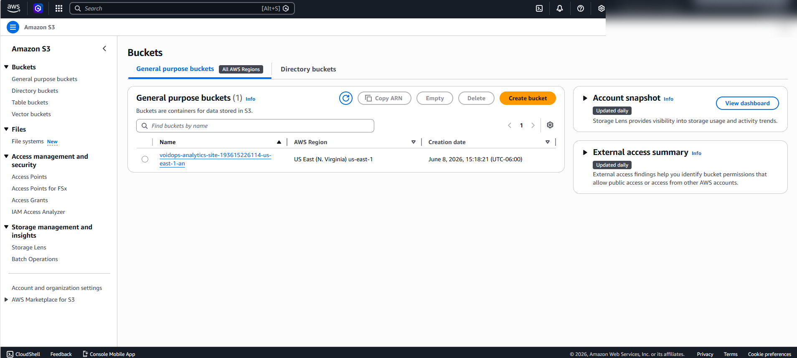
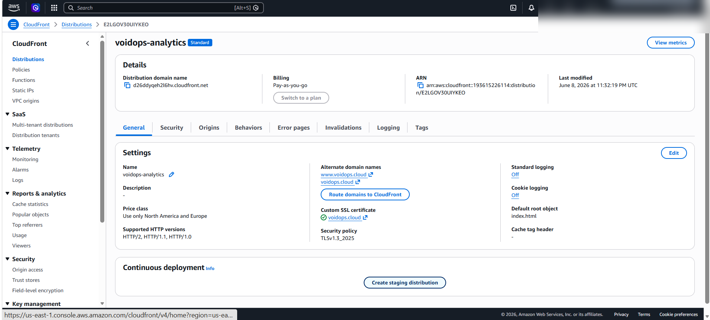
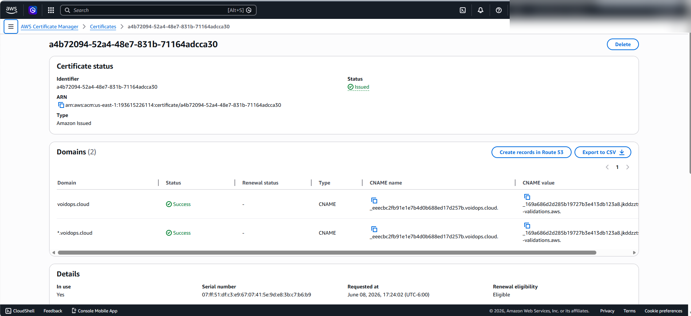
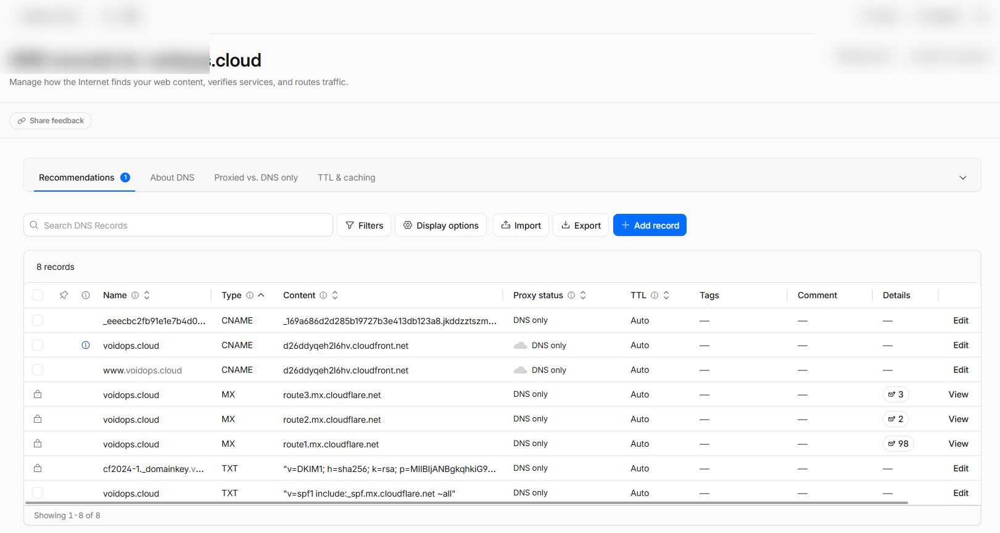
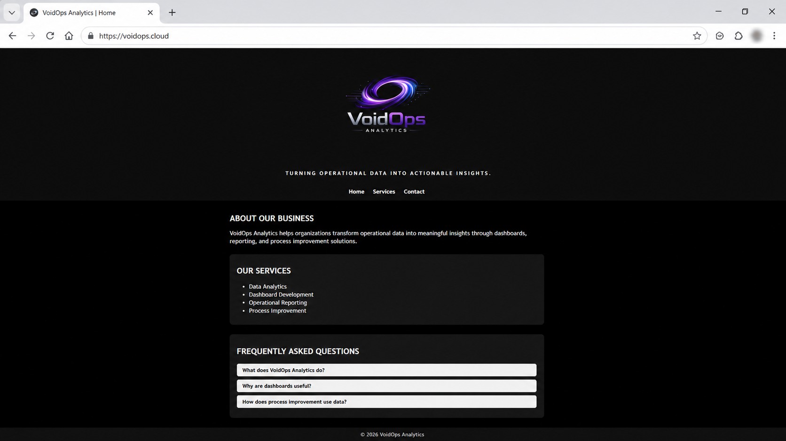

# Project 001 - VoidOps Analytics S3 Hosting

## Objective

Deploy the VoidOps Analytics website using Amazon S3 Static Website Hosting.

## AWS Services Used

* Amazon S3
* Amazon CloudFront
* AWS Certificate Manager (ACM)
* AWS IAM

## Skills Demonstrated

* S3 bucket creation
* Static website hosting
* IAM user management
* CloudFront distribution creation
* SSL/TLS certificate deployment
* Custom domain integration
* DNS validation
* Cloudflare DNS management
* HTTPS website delivery

## Architecture

User Browser
↓
Cloudflare DNS
↓
CloudFront Distribution
↓
AWS Certificate Manager (SSL)
↓
S3 Static Website Bucket

## Project Status

✅ Completed

### Final Deliverables

* Website deployed to S3
* CloudFront configured
* SSL certificate issued
* Custom domain connected
* HTTPS enabled
* www subdomain configured
* Cloudflare DNS configured
* Public website available at:

https://voidops.cloud

https://www.voidops.cloud

---

## Deployment Screenshots

### Amazon S3 Bucket Creation

### CloudFront Distribution Configuration

### ACM Certificate Issued

### Cloudflare DNS Records

### Live Production Website

---

## Lessons Learned

* Learned how static websites are hosted using Amazon S3.
* Configured CloudFront for secure content delivery.
* Used AWS Certificate Manager to enable HTTPS.
* Integrated a custom domain through Cloudflare DNS.
* Built a complete serverless web hosting solution using AWS services.
